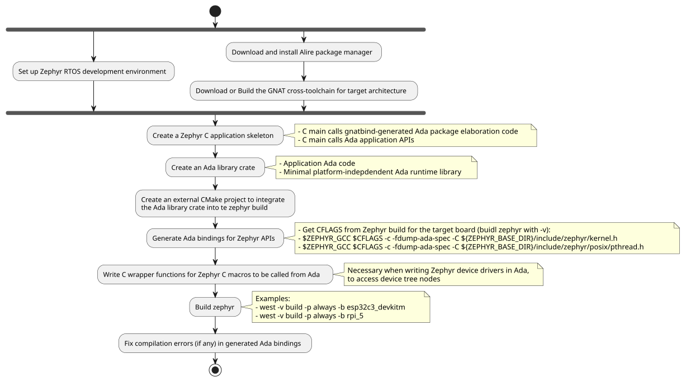

# zephyr_ada

This repo demonstrates a "light-weight" approach to write
embedded Ada applications on the Zephyr RTOS environment.

## What is Zephyr?
[Zephyr](https://docs.zephyrproject.org/latest/introduction/index.html) is an increasingly
popular real-time operating system (RTOS) that supports a wide range of microcontrollers and
boards and it is easily extensible to support custom SoCs and boards.

- Zephyr has its own development environment and build system (C centric)
- The Zephyr kernel supports many architectures, including:
    * ARMv6-M, ARMv7-M, and ARMv8-M (Cortex-M)
    * ARMv7-A and ARMv8-A (Cortex-A, 32- and 64-bit)
    * ARMv7-R, ARMv8-R (Cortex-R, 32- and 64-bit)
    * Intel x86 (32- and 64-bit)
    * RISC-V (32- and 64-bit)

- Zephyr supports a growing number of boards/platforms, which
  can be listed with the `west boards` comand:
  ```
  (.venv) $ west boards | wc -l
     770
  ```

- The Zephyr RTOS and its environment can be easily installed
  on Linux (Ubuntu), MaCOS and Windows, as described in the [Zephyr Getting Started Guide page](https://docs.zephyrproject.org/latest/develop/getting_started/index.html)

## Why Writing Ada Applications on Zephyr?
- Even if a baremetal GNAT cross-toolchain is
  available for the corrresponding architecture, the main obstacle for using Ada in many embedded platforms is the shortage of available ports of the
Ada Runtime Library (RTS), even a zero-foot-print RTS.
- If we had an Ada Runtime Library for Zephyr, we
  could get instant support for all the boards/platforms
  supported by Zephyr.

## How to Write Ada Applications on Zephyr?

